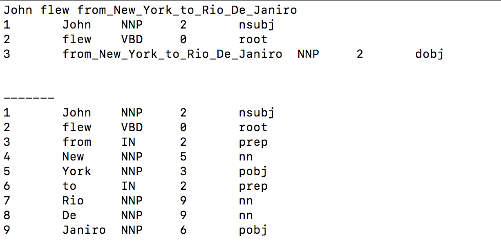

# Simple HTTP wrapper around [Dat Quoc Nguyen's ](https://github.com/datquocnguyen) [Joint POS Tagger and Dependency parser.](https://github.com/datquocnguyen/jPTDP)

### Installation steps

* conda create -n py27 python=2.7
* conda activate py27
* Clone this repository; Then change directory to JPTDP_wrapper and  run setup.sh which executes the following  commands

      $ pip install cython numpy
      $ pip install dynet==2.0.3
      $ pip install gdown
      $ fetch_model.sh  #to download pretrained  model
      

* then execute run_server.sh to expose tagging as a simple HTTP service

## Optional server wrapper with text cleaning and simple phrase gen

Note: This is required for unsupervised [NER](https://github.com/ajitrajasekharan/unsupervised_NER) 

* Installation

      $ pip install unidecode
      $ cd POS_wrapper
      $ make

* Then execute run_server.sh to expose this wrapper as a HTTP service

Confirm installation of both servers work by

$ wget -O POS "http://127.0.0.1:8073/John flew from New York to Rio De Janiro"

The output POS file should contain

## License

See [original license (GPL)](https://github.com/datquocnguyen/jPTDP/blob/master/License.txt)
